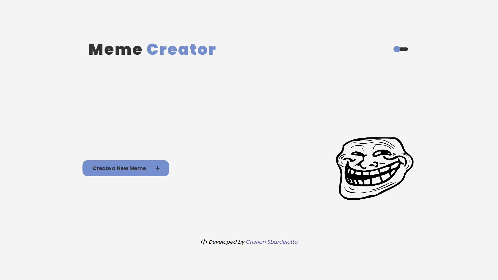
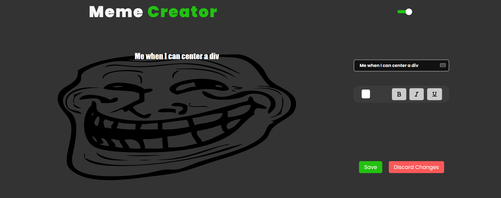

<h1 align="center"> Meme Creator </h1>

The project is a creator of memes. The user can use an image of his own machine and customize the font color and decoration.

After that, the user can also download the image.

The website has light/dark themes.

  <a href="#technologies">Technologies</a>&nbsp;&nbsp;&nbsp;|&nbsp;&nbsp;&nbsp;
  <a href="#usage">Usage</a>&nbsp;&nbsp;&nbsp;|&nbsp;&nbsp;&nbsp;
  <a href="#installation">Installation</a>&nbsp;&nbsp;&nbsp;|&nbsp;&nbsp;&nbsp;
  <a href="#layout">Layout</a>&nbsp;&nbsp;&nbsp;&nbsp;&nbsp;&nbsp;

 

Light Mode:

Dark mode:

<h1 id='technologies'>🖱️ Technologies</h2>

This project was made with the following technologies/libraries:

- ReactJS
- TypeScript
- Styled-Components
- Font-Awesome ( icons )
- Vite ( boilerplate )
- ESlint ( linter )

 

<h1 id='layout'>🖥️ Layout</h1>

 

> To see the Deploy, check [THIS LINK](https://meme-creator-kappa.vercel.app/)

 

<h1 id='usage'>🖥️ Usage</h1>

   

  

    <b>1.</b> On the website, you can create a new meme using an image of your machine
  

  

    <b>2.</b> To edit the image, you have to type you caption in the Input.
    You can also update font color and decoration.
  

  

    <b>3.</b> If you want to discard the current image, just press the "Discard changes" button. If you liked your meme, press the "Download" button to save the image on your device.
  

 

<h1 id='installation'>📤 Installation</h1>

<h3>Firstly, you need to <strong>clone the project</strong> on your machine:</h3>
 

<code>git clone https://github.com/cristian-sbardelotto/meme-creator</code>

 

<h3>After that, open the project folder and <strong>install the dependencies:</strong></h3>

<code>npm i</code>

<code>yarn</code>

<h3>To <strong>run the project</strong> on your browser, use:</h3>

<code>npm run dev</code>

<code>yarn dev</code>

 

---

<h2 align='center'>Enjoy this project!</h2>

 

Developed with ❤️ by <strong>Cristian Sbardelotto</strong>

 

